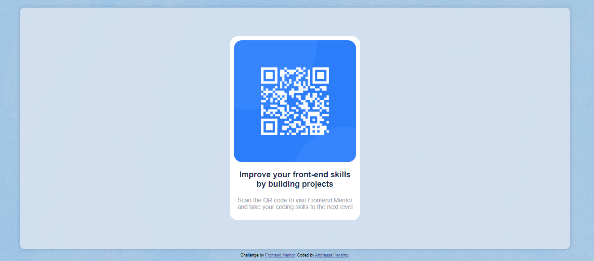
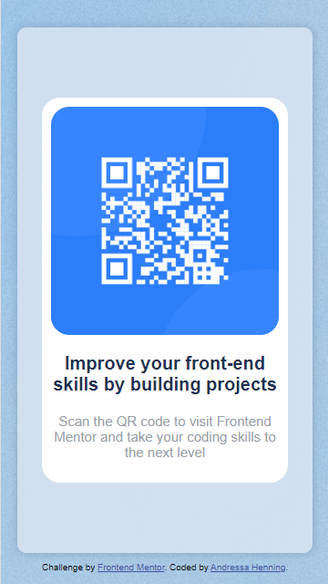

# Frontend Mentor - QR code component challenge

## Welcome! 👋

Thanks for checking out this front-end coding challenge.

[Frontend Mentor](https://www.frontendmentor.io) challenges help you improve your coding skills by building realistic projects. 🚀

## The challenge

My challenge was to build out this QR code component and get it looking as close to the design as possible.

## The result

### Expectation

### Reality

### Mobile expectation

### Mobile reality

